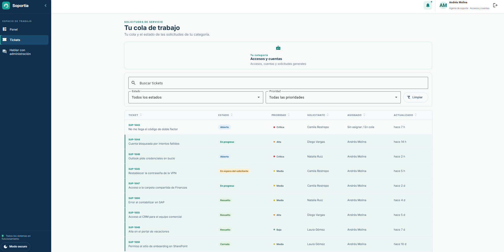
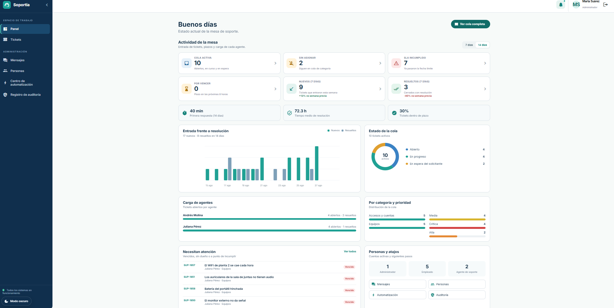
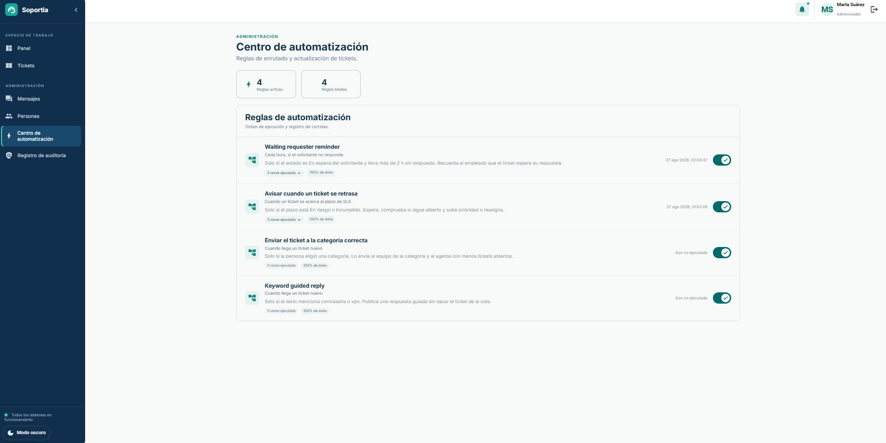
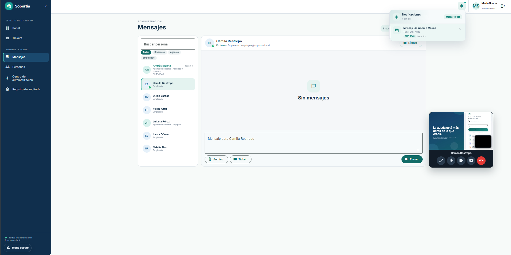

# **Soportia — Sistema de Gestión de Soporte Técnico**

Una aplicación full stack de helpdesk interno con paneles para empleados, agentes y administradores, plazos de SLA, auditoría, llamadas en tiempo real y automatización recuperable con n8n.

## Demo

<br>

<p align="center">
  
</p>

<p align="center">
  <em>Mesa de soporte con tickets, SLA, llamadas WebRTC y flujos de n8n orquestados desde Spring Boot.</em>
</p>

## Descripción general

Helpdesk interno con tres roles: el empleado abre la solicitud, el agente atiende solo la cola de su equipo y el administrador supervisa la mesa. La prioridad sale de impacto y urgencia; cada ticket lleva SLA en horario laboral.

Spring Boot es la fuente de verdad. n8n orquesta enrutado, escalación y recordatorios con webhooks firmados (HMAC) y callbacks idempotentes; si está apagado, la mesa sigue. Las llamadas van por WebRTC entre navegadores; el servidor solo señaliza por WebSocket.

## Características

- **Roles y colas:** Empleado, agente y administrador, con JWT. El agente no ve tickets de otro equipo; la automatización no asigna al admin.
- **SLA y estados:** Matriz de prioridad, plazos de primera respuesta y resolución, transiciones validadas en el servidor.
- **Automatización recuperable:** n8n asigna al agente con menos carga, publica una guía si el texto habla de contraseña o VPN, escala un SLA en riesgo y recuerda al solicitante. Un callback repetido no duplica cambios.
- **Llamadas en el ticket:** Presencia en línea, voz, video y pantalla. Se ofrece solo si la otra persona está conectada.
- **Auditoría:** Las acciones críticas quedan registradas para revisión administrativa.

## Screenshots

| Ticket del agente | Panel del administrador |
| :---: | :---: |
| <p align="center"></p> | <p align="center"></p> |

| Centro de automatización | Llamada en curso |
| :---: | :---: |
| <p align="center"></p> | <p align="center"></p> |

<p align="center">
  <em>Capturas de las pantallas principales. Las imágenes están en <a href="./assets/">assets/</a>.</em>
</p>

## Tecnologías utilizadas

- **Frontend:** Angular 22, Angular Material, RxJS, WebSocket, WebRTC, Playwright
- **Backend:** Java 21, Spring Boot 4.1, Spring Security (JWT), JdbcClient, Flyway
- **Datos e integración:** PostgreSQL, n8n, Docker Compose

## Requisitos e instalación

* Docker Desktop
* Java 21, Node.js 22 y npm (solo si se ejecuta fuera de Docker)

## Instalación rápida

```powershell
# 1. Clonar el repositorio
git clone https://github.com/JulianAyaO/sistema_tickets.git
cd sistema_tickets

# 2. Configurar el entorno
copy .env.example .env

# 3. Levantar el stack
docker compose --env-file .env up --build
```

La aplicación queda en:

```text
http://localhost:4200
```

El API en `http://localhost:8080/api/v1`, n8n en `http://localhost:5678` y HTTPS local en `https://localhost:4243` (útil para cámara y micrófono en algunos navegadores). La salud del backend se comprueba en:

```text
http://localhost:8080/actuator/health
```

Para activar las automatizaciones, abre n8n, importa los JSON de `automation/workflows` y publícalos. Los webhooks esperados son `soportia-ticket-routing` y `soportia-sla-alerts`.

## Variables de entorno

Copia el archivo `.env.example` si necesitas personalizar la configuración. En desarrollo local, los valores por defecto suelen ser suficientes.

| Variable | Descripción |
| --- | --- |
| `POSTGRES_*` | Conexión a PostgreSQL de la aplicación |
| `N8N_DB_*` | Base de metadatos de n8n, creada en el primer arranque |
| `JWT_SECRET` | Clave para generar y validar tokens JWT |
| `N8N_HMAC_SECRET` | Secreto compartido para firmar webhooks y callbacks (`X-Soportia-Timestamp` y `X-Soportia-Signature`) |
| `N8N_ROUTING_WEBHOOK_URL` | Webhook de n8n para el enrutado de tickets nuevos |
| `N8N_SLA_WEBHOOK_URL` | Webhook de n8n para tickets con SLA en riesgo |
| `SOPORTIA_SLA_WAIT_SECONDS` | Espera de n8n antes de volver a consultar un ticket en riesgo |
| `SOPORTIA_WAITING_HOURS` | Horas sin respuesta del solicitante antes del recordatorio |

## Despliegue

Actualmente, el proyecto está orientado principalmente a **desarrollo y ejecución en entorno local**. Por el momento no se encuentra disponible una demo pública en la web.


## Estructura del proyecto

```text
sistema_tickets/
├── .github/workflows/         # configuración de integración continua (CI)
├── assets/                    # gif de demo y capturas para el README
├── automation/                # flujos n8n y contrato de automatización
├── backend/                   # API y lógica del backend con Spring Boot
├── frontend/                  # aplicación web desarrollada con Angular
├── infra/                     # inicialización adicional de PostgreSQL
├── compose.yaml               # PostgreSQL, backend, frontend y n8n
├── .env.example               # ejemplo de variables de entorno
└── README.md
```

## Autor

**Julian Aya Orozco**

[](https://github.com/JulianAyaO)
[](https://www.linkedin.com/in/julian-aya-orozco-338a78431/)
