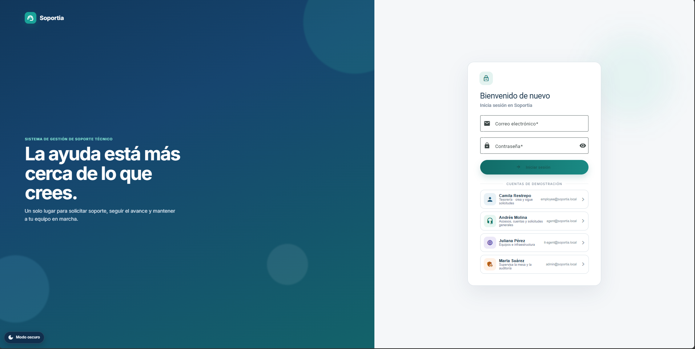
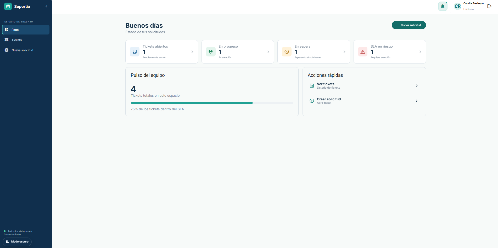
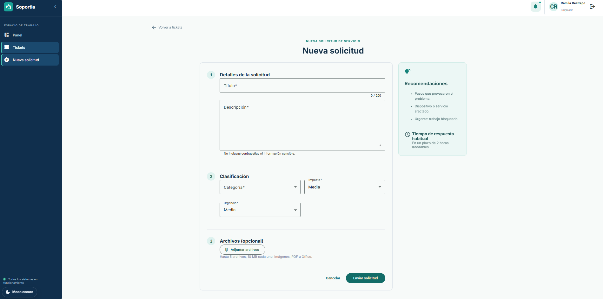
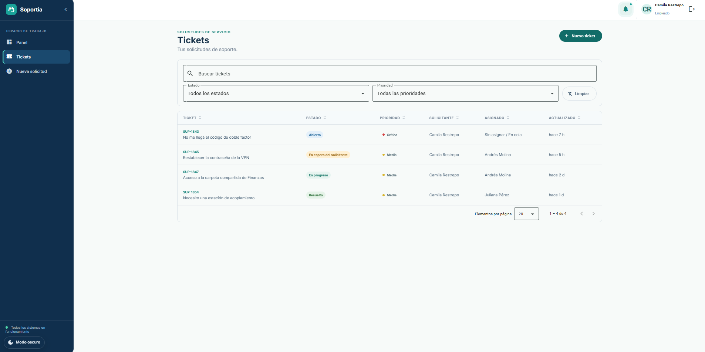
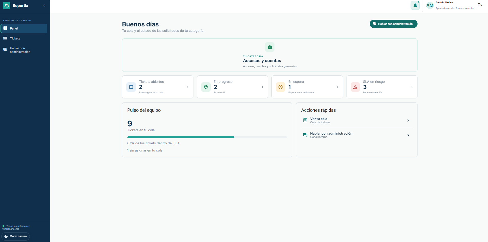
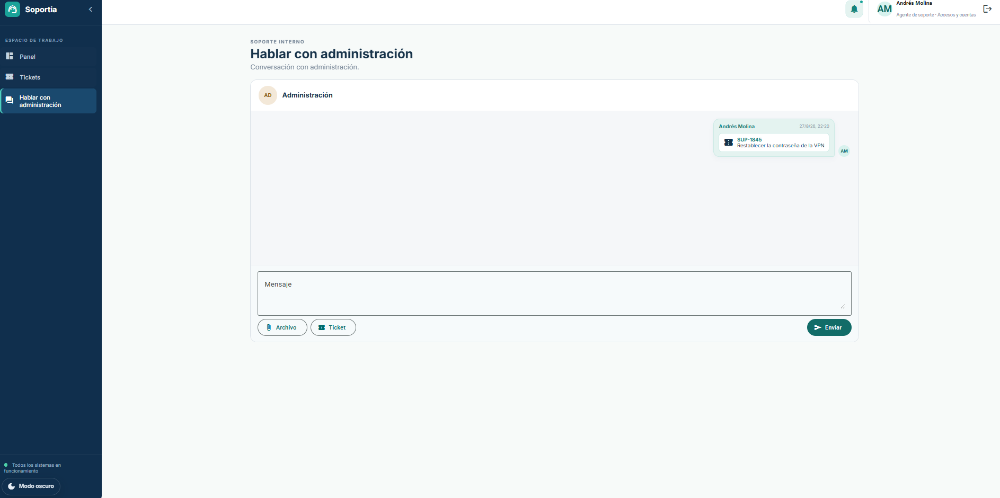
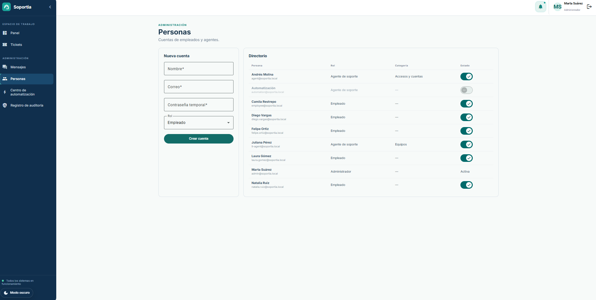
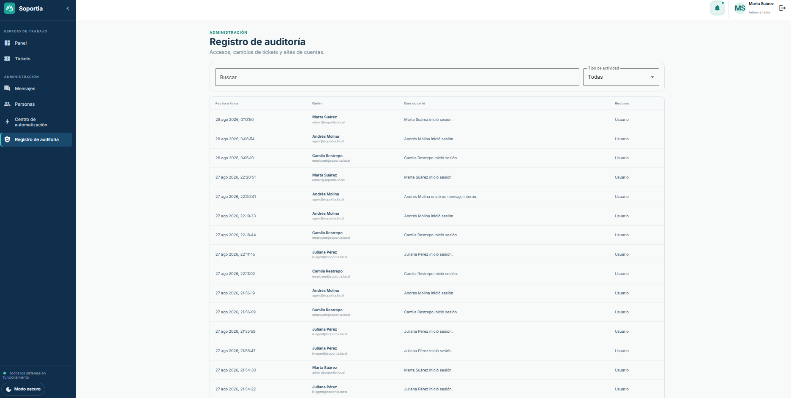

# **Soportia — Sistema de Gestión de Soporte Técnico**

Una aplicación full stack de helpdesk interno con paneles para empleados, agentes y administradores, plazos de SLA, auditoría, llamadas en tiempo real y automatización recuperable con n8n.

## Demo

<br>

<p align="center">
  
</p>

<p align="center">
  <em>Mesa de soporte con tickets, SLA, llamadas WebRTC y flujos de n8n orquestados desde Spring Boot.</em>
</p>

## Descripción general

Soportia está diseñada para gestionar el flujo de un ticket de soporte técnico, desde la solicitud del empleado hasta la cola del agente, la supervisión del administrador y las automatizaciones externas.

El proyecto busca demostrar reglas de negocio reales en un solo sistema: prioridad, transiciones de estado, comentarios, adjuntos, notificaciones, presencia, llamadas y auditoría. Los empleados crean tickets por categoría, impacto y urgencia. Los agentes atienden solo la cola de su equipo, responden, dejan notas internas y pueden llamar al solicitante si está en línea. Los administradores consultan el panel operativo, las personas, el Centro de automatización, los mensajes internos y el registro de auditoría.

La aplicación se desarrolló como proyecto de portafolio con un backend en Spring Boot, PostgreSQL, un frontend en Angular y n8n como orquestador externo. Spring permanece como fuente de verdad: n8n no escribe en las tablas de la aplicación. Si n8n está apagado, crear y gestionar tickets sigue funcionando; los eventos pendientes se reintentan al volver.

## Características

- **Ciclo de vida de tickets:** Los tickets pasan por abierto, en progreso, en espera del solicitante, resuelto, cerrado y cancelado, con transiciones validadas en el servidor.
- **Prioridad y SLA:** La prioridad se calcula con una matriz de impacto y urgencia, y cada ticket conserva plazos de primera respuesta y resolución en horario laboral.
- **Colas por equipo:** Los agentes de accesos y de equipos ven únicamente los tickets de su área. El administrador supervisa toda la mesa y no recibe asignaciones automáticas.
- **Comentarios y notas internas:** El solicitante ve respuestas públicas; el personal puede dejar notas internas que no salen al empleado.
- **Adjuntos:** Se pueden adjuntar archivos al ticket y a los mensajes internos.
- **Notificaciones:** El usuario recibe avisos de asignación, respuestas, cambios de estado y acciones de automatización.
- **Presencia en línea:** Un canal WebSocket marca quién está conectado. En el ticket, el agente ve si el empleado está en línea antes de llamar.
- **Llamadas de voz, video y pantalla:** Desde el ticket o el chat interno se inicia una llamada WebRTC. Spring solo señaliza la sesión; el audio y el video van entre los navegadores.
- **Control de acceso por roles:** Empleado, agente de soporte y administrador, con autenticación JWT.
- **Enrutado automático:** Tras crear un ticket, n8n consulta la carga del equipo y pide a Spring asignar al agente con menos tickets abiertos.
- **Respuestas guiadas:** Si el texto menciona contraseña o VPN, n8n publica un comentario de ayuda y el ticket sigue en cola.
- **Escalación de SLA:** Si el ticket sigue abierto cerca del plazo, n8n espera, vuelve a consultarlo y puede subir la prioridad o reasignarlo a otro agente.
- **Recordatorio al solicitante:** Un flujo horario recuerda al empleado cuando el ticket espera su respuesta.
- **Auditoría:** Las acciones críticas quedan registradas para revisión administrativa.

## Screenshots

Capturas de las pantallas principales. Las imágenes están en [`assets/`](assets/).

### Acceso

<p align="center">
  
</p>

<p align="center">
  <em>Inicio de sesión con cuentas de demostración por rol.</em>
</p>

### Empleado

| Panel | Nueva solicitud |
| :---: | :---: |
| <p align="center"></p> | <p align="center"></p> |

| Detalle del ticket |
| :---: |
| <p align="center"></p> |

### Agente

| Panel | Ticket en cola |
| :---: | :---: |
| <p align="center"></p> | <p align="center"></p> |

| Chat interno |
| :---: |
| <p align="center"></p> |

### Administración

| Panel operativo | Personas |
| :---: | :---: |
| <p align="center"></p> | <p align="center"></p> |

| Centro de automatización | Auditoría |
| :---: | :---: |
| <p align="center"></p> | <p align="center"></p> |

| Mensajes y llamadas |
| :---: |
| <p align="center"></p> |

## Tecnologías utilizadas

### Frontend

- **Angular 22:** Utilizado para construir la aplicación web, las rutas y el estado de pantalla.
- **Angular Material / CDK:** Proporciona la interfaz, formularios, overlays y componentes de accesibilidad.
- **RxJS:** Gestiona las peticiones HTTP, el polling y el estado reactivo de la interfaz.
- **WebSocket nativo:** Mantiene la presencia en línea y la señalización de llamadas.
- **WebRTC:** Transporta el audio, el video y la pantalla compartida entre los participantes.
- **Playwright:** Utilizado para las pruebas de aceptación en el navegador.

### Backend

- **Java 21:** Lenguaje principal utilizado en el desarrollo del backend.
- **Spring Boot 4.1:** Framework backend utilizado para APIs REST, seguridad, programación de tareas y configuración.
- **Spring Security:** Gestiona la autenticación con JWT, la autorización y el control de acceso basado en roles.
- **JdbcClient:** Encargado del acceso SQL a PostgreSQL.
- **Spring WebSocket:** Proporciona presencia en línea, escritura en curso y señalización de llamadas.
- **Flyway:** Gestiona las migraciones de la base de datos.

### Base de datos

- **PostgreSQL:** Base de datos relacional principal del sistema. Conserva tickets, historial, auditoría y el outbox de eventos hacia n8n.

### Herramientas / Librerías / Servicios

- **Docker Compose:** Utilizado para ejecutar PostgreSQL, el API, el frontend y n8n en local.
- **n8n:** Orquestador externo de enrutado, respuestas guiadas, escalación de SLA y recordatorios. Recibe webhooks firmados y responde con callbacks idempotentes.
- **Maven Wrapper:** Herramienta de construcción del backend, incluida en el proyecto para facilitar la portabilidad.
- **npm:** Gestor de paquetes del frontend.
- **Micrometer / Actuator:** Proporcionan endpoints de métricas y verificación de estado.
- **Swagger / OpenAPI:** Proporcionan la documentación de la API y sus endpoints.

## Requisitos e instalación

## Requisitos

* Docker Desktop
* Java 21, Node.js 22 y npm (solo si se ejecuta fuera de Docker)

## Instalación rápida

```powershell
# 1. Clonar el repositorio
git clone https://github.com/JulianAyaO/sistema_tickets.git
cd sistema_tickets

# 2. Configurar el entorno
copy .env.example .env

# 3. Levantar el stack
docker compose --env-file .env up --build
```

La aplicación queda en:

```text
http://localhost:4200
```

El API en `http://localhost:8080/api/v1`, n8n en `http://localhost:5678` y HTTPS local en `https://localhost:4243` (útil para cámara y micrófono en algunos navegadores). La salud del backend se comprueba en:

```text
http://localhost:8080/actuator/health
```

Para activar las automatizaciones, abre n8n, importa los JSON de `automation/workflows` y publícalos. Los webhooks esperados son `soportia-ticket-routing` y `soportia-sla-alerts`.

## Variables de entorno

Copia el archivo `.env.example` si necesitas personalizar la configuración. En desarrollo local, los valores por defecto suelen ser suficientes.

| Variable | Descripción |
| --- | --- |
| `POSTGRES_*` | Conexión a PostgreSQL de la aplicación |
| `N8N_DB_*` | Base de metadatos de n8n, creada en el primer arranque |
| `JWT_SECRET` | Clave para generar y validar tokens JWT |
| `N8N_HMAC_SECRET` | Secreto compartido para firmar webhooks y callbacks (`X-Soportia-Timestamp` y `X-Soportia-Signature`) |
| `N8N_ROUTING_WEBHOOK_URL` | Webhook de n8n para el enrutado de tickets nuevos |
| `N8N_SLA_WEBHOOK_URL` | Webhook de n8n para tickets con SLA en riesgo |
| `SOPORTIA_SLA_WAIT_SECONDS` | Espera de n8n antes de volver a consultar un ticket en riesgo |
| `SOPORTIA_WAITING_HOURS` | Horas sin respuesta del solicitante antes del recordatorio |

## Despliegue

Actualmente, el proyecto está orientado principalmente a **desarrollo y ejecución en entorno local**. Por el momento no se encuentra disponible una demo pública en la web.

## Uso del sistema

Todas las cuentas demo usan la contraseña `Demo123!`.

| Persona | Correo | Rol |
| --- | --- | --- |
| Camila Restrepo | `employee@soportia.local` | Empleada de tesorería |
| Andrés Molina | `agent@soportia.local` | Agente de accesos y cuentas |
| Juliana Pérez | `it-agent@soportia.local` | Agente de equipos |
| Marta Suárez | `admin@soportia.local` | Administradora de la mesa |

1. El empleado inicia sesión y crea un ticket con categoría, impacto, urgencia y descripción.
2. Spring calcula la prioridad y los plazos de SLA, deja el ticket en la cola del equipo y registra un evento outbox.
3. n8n recibe el evento, consulta los agentes del equipo y pide asignar al de menor carga. Si el texto menciona contraseña o VPN, publica una guía y el ticket sigue abierto.
4. El agente toma el ticket, responde, deja notas internas o lo pasa a espera / resuelto. Si el empleado está en línea, puede llamarlo desde el detalle.
5. Si el ticket sigue abierto cerca del plazo, n8n espera, vuelve a leer el estado y solo escala si nadie lo ha tomado: sube la prioridad y, si hace falta, lo reasigna.
6. Si el ticket espera respuesta del empleado, un flujo horario envía un recordatorio.
7. El administrador consulta el panel, las personas, el Centro de automatización, los mensajes internos y la auditoría. Puede tomar un ticket a mano, pero la automatización no se lo asigna.

## Estructura del proyecto

```text
sistema_tickets/
├── .github/workflows/         # configuración de integración continua (CI)
├── assets/                    # gif de demo y capturas para el README
├── automation/                # flujos n8n y contrato de automatización
├── backend/                   # API y lógica del backend con Spring Boot
├── docs/                      # arquitectura, ADR y checklist de demo
├── frontend/                  # aplicación web desarrollada con Angular
├── infra/                     # inicialización adicional de PostgreSQL
├── compose.yaml               # PostgreSQL, backend, frontend y n8n
├── .env.example               # ejemplo de variables de entorno
└── README.md
```

### Carpetas importantes

- `backend/.../auth`: Contiene la lógica de autenticación, JWT e inicio de sesión.
- `backend/.../ticket`: Gestiona el ciclo de vida de los tickets, comentarios, adjuntos, prioridad y SLA.
- `backend/.../sla`: Detecta tickets en riesgo o con plazo incumplido.
- `backend/.../outbox`: Publica eventos firmados hacia n8n y recibe callbacks idempotentes.
- `backend/.../realtime`: Contiene presencia en línea y señalización de llamadas.
- `backend/.../automation`: Expone reglas y ejecuciones del Centro de automatización.
- `backend/.../support`: Gestiona el chat interno entre agentes y administración.
- `frontend/src/app/features`: Contiene las pantallas de tickets, dashboard, soporte y administración.
- `frontend/src/app/core/call`: Incluye el cliente WebRTC, el overlay de llamada y los controles de micrófono, cámara y pantalla.
- `automation/workflows`: Contiene los JSON que se importan en n8n.
- `infra`: Crea la base de datos de n8n en el primer arranque de PostgreSQL.
- `assets`: Incluye el gif de demostración y las capturas del README.

### Módulos principales de la API REST

- **Autenticación:** Gestiona el inicio de sesión, la renovación de token y el cierre de sesión.
- **Tickets:** Administra la creación, el listado, la asignación, las transiciones, los comentarios y los adjuntos.
- **Catálogo:** Proporciona categorías y políticas de SLA para el alta de tickets.
- **Notificaciones:** Permite consultar los avisos del usuario autenticado.
- **Dashboard:** Expone conteos operativos, volumen, SLA y carga de agentes según el rol.
- **Administración:** Incluye usuarios, auditoría y Centro de automatización.
- **Mensajes internos:** Gestiona la bandeja interna del personal y sus adjuntos.
- **Integración n8n:** Recibe consultas firmadas (ticket, agentes del equipo, cola en espera) y callbacks; no está pensada para el navegador.

### Automatización con n8n

n8n no es la base de datos de Soportia. El patrón es outbox más callback:

1. Un cambio de negocio (por ejemplo, `ticket.created` o un SLA en riesgo) se confirma en PostgreSQL junto con un evento outbox.
2. Un publicador envía el evento a n8n con HMAC (`X-Soportia-Timestamp` y `X-Soportia-Signature`).
3. n8n orquesta esperas, condiciones y lecturas. Cuando debe mutar un ticket, llama a Spring con una clave de idempotencia.
4. Spring valida la firma, aplica el comando una sola vez y deja historial y notificaciones.

Los cuatro flujos versionados en `automation/workflows` son:

- **Auto route:** Enruta el ticket al equipo de la categoría y lo asigna al agente con menos carga.
- **Keyword guided reply:** Publica una respuesta guiada si el texto habla de contraseña o VPN, sin sacarlo de la cola.
- **SLA alert:** Espera, vuelve a consultar el ticket y, si sigue abierto, sube la prioridad o lo reasigna. Avisa al agente o al equipo, no al administrador.
- **Waiting reminder:** Recorre tickets en espera del solicitante y le envía un recordatorio.

Repetir un callback no duplica asignaciones ni comentarios. Apagar n8n no impide usar la mesa; al encenderlo, los eventos pendientes se reintentan.

### Comunicación en tiempo real y llamadas

El backend utiliza WebSockets para presencia y señalización. El medio de la llamada no pasa por el servidor.

- **Presencia:** El cliente anuncia que el usuario está en línea. En el detalle del ticket aparece si la otra persona está conectada.
- **Señalización:** Invite, aceptación, rechazo, colgar y candidatos ICE viajan por el WebSocket autenticado con JWT.
- **WebRTC:** El audio, el video y la pantalla se negocian entre navegadores con un servidor STUN público.
- **Controles:** Micrófono, cámara, compartir pantalla, minimizar y colgar, en un overlay que no saca al usuario del ticket.
- **Origen de la llamada:** Desde el detalle del ticket (empleado ↔ agente asignado) o desde Mensajes (agente ↔ administración).

La llamada solo se ofrece si el destinatario está en línea y no hay otra sesión activa. Si está ocupado o desconectado, el origen recibe el estado correspondiente.

## Contribuciones

Las contribuciones, mejoras y sugerencias son bienvenidas.

Flujo de trabajo sugerido:

1. Haz un fork del repositorio.
2. Crea una rama para tu nueva funcionalidad o corrección.
3. Realiza los cambios necesarios en el proyecto.
4. Ejecuta las verificaciones del backend y del frontend.
5. Abre un pull request con una descripción clara de los cambios realizados.

## Autor

**Julian Aya Orozco**

[](https://github.com/JulianAyaO)
[](https://www.linkedin.com/in/julian-aya-orozco-338a78431/)
